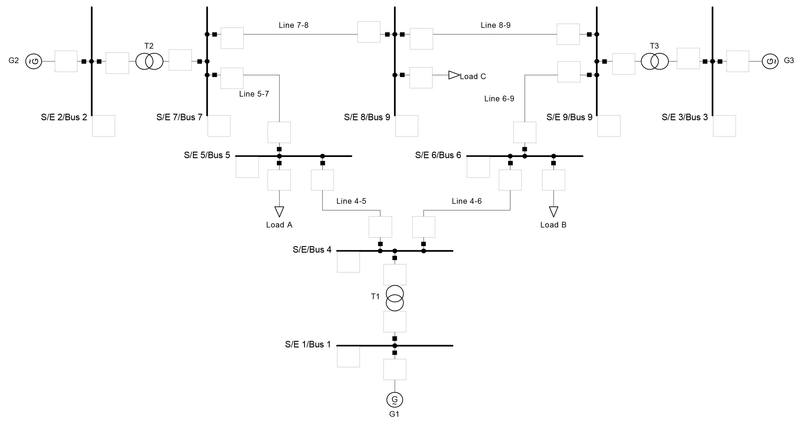
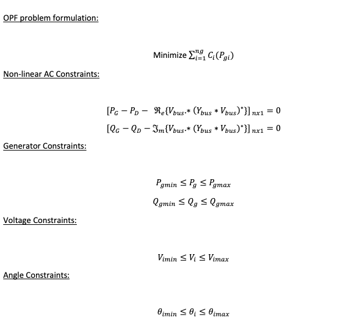
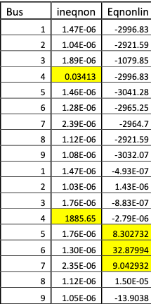
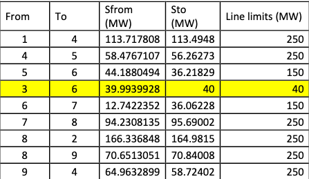
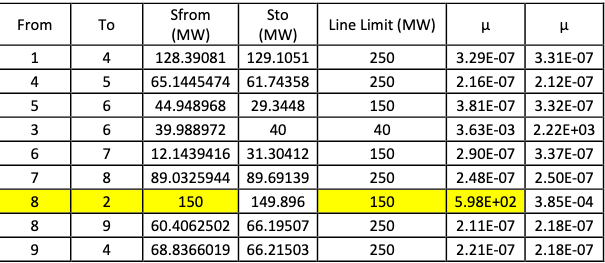

# Optimal Power flow

  <b>9 Bus System</b> 
  

- [ ] OPF = ED + PF (Economic Dispath + Powerflow)

  - Economic Dispath ignors the limits impaired by the devices in the transmison system. Each transmission line and transformer has a limit on the amounf of power that can be transmitted through it. The limits arise because of thermal, voltage or stability considerations.

  - OPF can be solved using the Linear Programming (LP) approach or the Non-linear programming approach (NLP). The LP OPF solution algoirthitm iterates between solving the power Flow to determine the flow of power in the system devices and solving an LP to economically dispatch the generation subject to the Transmission system limits

---

  <b>Formulas</b> 
  

---

1. Solve the optimal power flow problem for the 9 Bus system Demonstrate which constraints are active and calculate the total cost.
   - `Total cost: $5811.5/h`
   - Active constraints
     - Power Dispatch (MW): Pg1 =113.025
     - Pg2 = 164.236698522775
     - Pg3 = 39.9939217310663

  <b>Active constraints  </b> 
  

---

2. Increase or decrease the total demanded power by 1 MW to 316 MW.
   - Total cost = $5842.
   - (5842 – 5811)/he = $31/hr - The difference is equal to lambda or the shadow price. If no constraints were active then
     lambda will be equal to the marginal cost

---

3. Observe the power flowing through the transmission lines and change the limit for one of them
   so that it would be operating at its limit. Calculate the total cost and compare with the previous
   cost.

  <b>Transmission line values with limits unaltered </b> 
  

- When the limit for the line going from bus 8 to bus 2 (i.e. branch 7) is decreased to 150MW, the result is shown in Table 3 below.
  - `The cost increases to $5858 from $5811.`
  - The increase in cost is because of line congestion.
    When the line gets congested, the utility company has to find an alternate way to dispatch
    power to the end user, which might mean using an expensive generating unit through a
    longer line; thus increasing the cost of dispatch.

  <b></b> 
  

- When the limit for branch 7 is decreased from 250MW to 150MW, Sfrom hits the limit as can be
  seen from table 3 above. The Lagrangian multipliers, μ of 598 shows that branch 7 is active.
  Branch 4 has always been active.

---

4. Observe the chosen Active Power setpoints for the generators and change the limit for one of
   them so that it would be operating at its limit. Calculate the total cost and compare with the
   previous cost
   - `Total cost: $6649/h`
   

     <b>Table 4: The max real power of bus 2 was reduced from 300MW to 100MW</b> 
     
   

